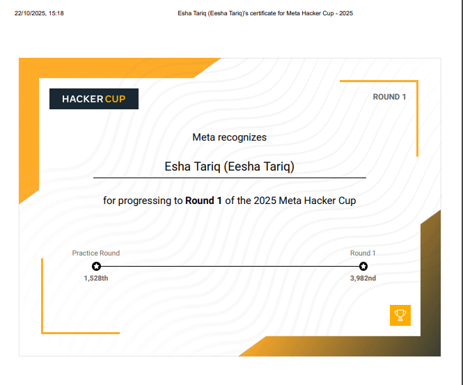
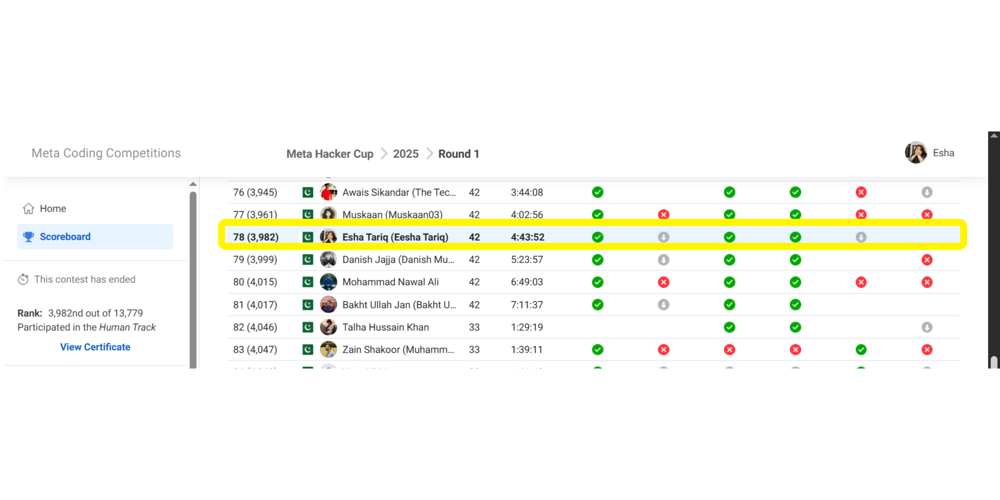

# Meta Hacker Cup 2025 — Competitive Programming Repository

This repository contains my official submissions and optimized solutions for **Meta Hacker Cup 2025**, Meta’s international competitive programming championship that challenges algorithmic thinking, optimization, and real-time problem-solving ability.

---

## 🏆 Practice Round

The **Practice Round** served as the warm-up phase for the competition, allowing participants to familiarize themselves with the problem format, scoring system, and time constraints.  
I successfully **completed and cleared the Practice Round**, ensuring my eligibility for the official rounds.

---

## 🚀 Round 1 & Round 2 Qualification

After the practice phase, I participated in the official competitive rounds of **Meta Hacker Cup 2025** organized by **Meta (Facebook)**.

- Advanced through **Round 1** with high accuracy and optimized submissions.  
- Officially **qualified for Round 2 (Advance Round)**, performing among the world’s top competitors.  
- Achieved ranking within the **Top 5000 globally** and **Top 80 in Pakistan**, competing against thousands of elite programmers worldwide.

---

## 📊 Official Scoreboard

Below is a glimpse of my performance and progression in the **Meta Hacker Cup 2025**.

---

## 🧩 Contest Problems

| Problem ID | Title | Points | Core Concepts |
|-------------|--------|---------|----------------|
| A1 | Snake Scales (Chapter 1) | 9 | Greedy algorithms, pattern computation |
| A2 | Snake Scales (Chapter 2) | 13 | Dynamic programming, state optimization |
| B1 | Final Product (Chapter 1) | 10 | Modular arithmetic, integer transformations |
| B2 | Final Product (Chapter 2) | 23 | Algorithmic complexity reduction |
| C | Narrowing Down | 24 | Binary search, mathematical modeling |
| D | Crash Course | 26 | Graph theory, combinatorial optimization |

All problems were implemented and tested in **Python**, following computational efficiency and clean code design principles.

---

## ⚙️ Technical Focus

1. **Algorithmic Thinking:** Translating abstract mathematical logic into structured code.  
2. **Optimization:** Designing scalable and time-efficient algorithms.  
3. **Precision:** Maintaining numerical accuracy under modular constraints.  
4. **Code Readability:** Writing clear, modular, and reusable functions.  
5. **Performance Engineering:** Ensuring solutions perform consistently across large datasets.

---

## 📈 Key Takeaways

- Learned to perform under **real-time contest pressure** with large input handling.  
- Strengthened understanding of **brute-force vs. greedy vs. DP** approaches.  
- Gained mastery in **algorithmic complexity analysis** and **Python optimization**.  
- Built efficient **debugging and testing workflows** for high-stakes programming contests.

---

## 🔗 References

- [Meta Hacker Cup Official Website](https://www.metacup.com)  
- [GitHub Repository](https://github.com/codewithEshaYoutube/Meta_Hacker_Cup_2025)  
- **Author:** Eesha Tariq  
- **Achievement:** Qualified for **Round 2 (Top 5000 Global, Top 80 Pakistan)**

---
