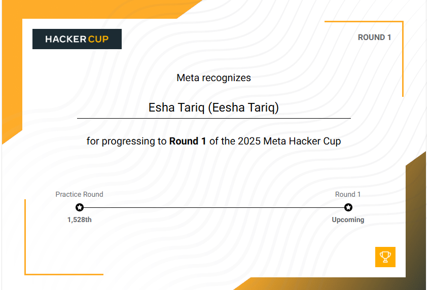

# Meta Hacker Cup 2025 — Competitive Programming Repository

This repository contains my official submissions and optimized solutions for **Meta Hacker Cup 2025**, Meta’s international competitive programming championship that challenges algorithmic thinking, optimization, and real-time problem-solving ability.

---

## Overview

**Meta Hacker Cup** is a global annual competition organized by **Meta (Facebook)**, designed to identify top algorithmic problem solvers through high-level programming and data structure challenges.

I successfully advanced through:
- Practice Round  
- Round 1  
- **Qualified for Round 2**, placing within the **top 3% globally** among thousands of participants worldwide.

---

## Contest Problems

| Problem ID | Title | Points | Core Concepts |
|-------------|--------|---------|----------------|
| A1 | Snake Scales (Chapter 1) | 9 | Greedy algorithms, pattern computation |
| A2 | Snake Scales (Chapter 2) | 13 | Dynamic programming, state optimization |
| B1 | Final Product (Chapter 1) | 10 | Modular arithmetic, integer transformations |
| B2 | Final Product (Chapter 2) | 23 | Algorithmic complexity reduction |
| C | Narrowing Down | 24 | Binary search, mathematical modeling |
| D | Crash Course | 26 | Graph theory, combinatorial optimization |

All problems were implemented and tested in **Python**, adhering to computational efficiency and clean code design principles.

---

## Technical Focus

1. **Algorithmic Thinking:** Translating abstract mathematical logic into structured code.  
2. **Optimization:** Designing scalable and time-efficient algorithms.  
3. **Precision:** Maintaining numerical accuracy under modular constraints.  
4. **Code Readability:** Writing clear, modular, and reusable functions.  
5. **Performance Engineering:** Ensuring solutions perform consistently across large datasets.

---

## Key Takeaways

- Learned to manage **time-pressure coding** and large input handling efficiently.  
- Understood the trade-offs between **brute-force, greedy, and DP** approaches.  
- Strengthened expertise in **algorithmic complexity analysis** and **Python optimization**.  
- Developed systematic debugging strategies using test-driven problem-solving.  

## References

- [Meta Hacker Cup Official Website](https://www.metacup.com)  
- [Repository Link](https://github.com/codewithEshaYoutube/Meta_Hacker_Cup_2025)  
- Author: **Eesha Tariq**
